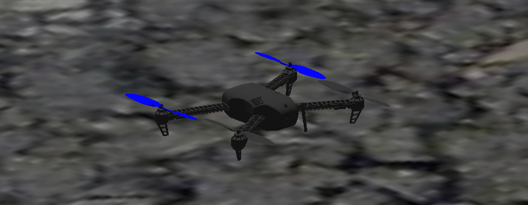
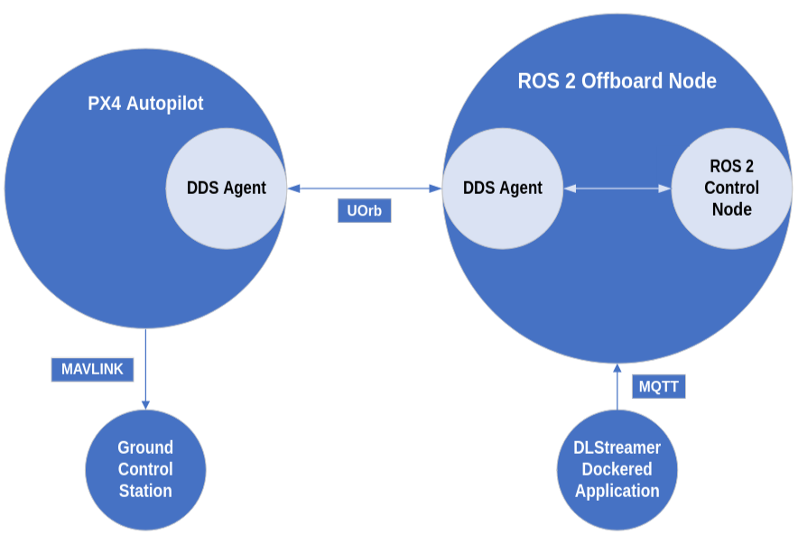

# Offboard ROS 2 DDS

<!--Nah, I'd push-->
This project contains the code for offboard control with ROS 2 made during my curricular ed-of-studies internship at CATEC using DDS to communicate with PX4's autopilot.

<!---->


## Dependencies

To use the code hosted on this repo, it is required that you use <a href="https://www.docker.com/" target="_blank" rel="noreferrer">Docker</a>. To install Docker Engine, which is the required part, you can find the instructions <a href="https://docs.docker.com/engine/install/ubuntu/" target="_blank" rel="noreferrer">here</a>.

<!--TODO: Introducir DLStreamer aqui-->

## Usage

You should first build the docker, since all the implementation was tested on it. The command to build the docker is commented inside the <em>docker_run.sh</em> file. This takes around 14 minutes.
```
docker build -t braismtnez/ros2dds ./workspace/micro_ros2/braismtnez-ros2sim/.
```

## Diving Deeper

- https://bitbucket.org/fadacatec-ondemand/px4_ros2_simulation 

## Contact

Brais Martínez -> bmartinez.ext@catec.aero